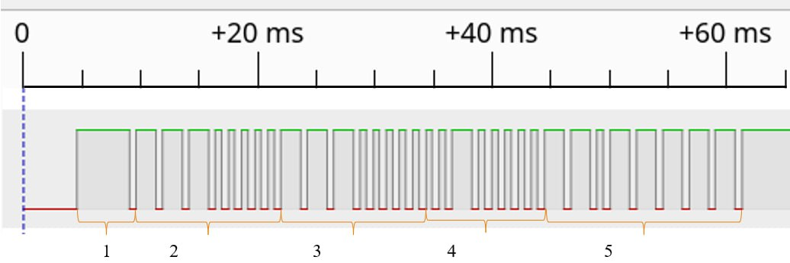

## Моторизированная тележка управляемая по ИК от стандартного пульта ДУ
### Модуль цифровой схемы для декодирования сигналов с ИК приемника.
Этот модуль позволяет декодировать сигнал от пульта в команду 32-бит.
При отсутствии управляющего сигнала (от пульта), на выходе приёмника всегда выдает сигнал уроеня 1. Когда приемник получает ИК сигнал с пульта, на выходе приемника выдается сигнал, показанный на рисунке.
Сигнал состоит из: стартового бита (1),  адреса устройства (2), инвертированного адреса устройства (3), команды (4) и инвертированной команды (5).

Модуль спроектирован для работы на плате ["Карно"](https://github.com/Fabmicro-LLC/Karnix_ASB-254), на базе ПЛИС Lattice ECP5.

#### Входные сигналы:
* ИК сигнал от пульта;
* clk - тактовая частота;
* ack - сигнал от модуля Control, обеспечивающий сброс ir_ready после выполнения одной команды;
* rst - сигнал сброса;
* enable - разрешающий сигнал.

#### Выходные сигналы:
* command (32-бит) - код команды;
* ir_ready - сигнал готовности.

#### Алгоритм работы декодера:
1. Приемник подключается на плату через выход gpio[3];
2. В коде использован 1 счетчик, чтобы определить время между 2 сигналами фронта тактового сигнала;
4. Если время между фронтами равно 3.5 мс (стартовый бит), то начинается запись кода;
5. Если время между фронтами равно 1.1 мс (сигнал 0), то выходной сигнал равен нулю;
6. Если время между фронтами равно 2.2 мс (сигнал 1), то выходной сигнал равен единице;
7. После записи команды поднимается флаг ir_ready, после чего сигнал передается в модуль control;
8. После обработки команды в модуле control, флаг ack обнуляет ir_ready.

#### Тестирование модуля на ОС Linux:
1. Установить тулы YosysHQ, openFPGALoader, make;
2. Скачать папку ir_decoder в любую рабочую директорию;
3. Внутри директории ir_decoder выполнить `make upload`;
